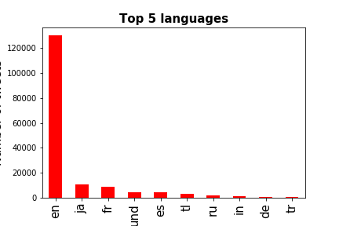
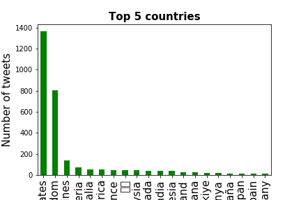
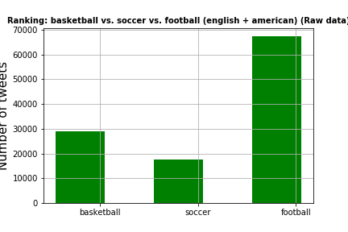
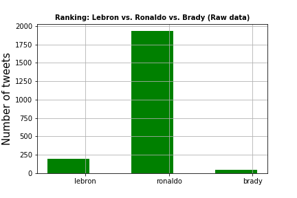

# 10-final-project-saadi12k
10-final-project-saadi12k created by GitHub Classroom

There are two parts to this project. 1) data acquisition and 2) data analysis. 
First we use tweepy, an API for Twitter, to screen and store any tweets mentioning certain keywords.
Second we use 4 different Python libraries (json/pandas/matplotlib/re) to read/store/analyze/manipulate/plot the raw data.

## Getting Started

These instructions will get you a copy of the project up and running on your local machine for development and testing purposes. See deployment for notes on how to deploy the project on a live system.
#
To get the data, you will need to either run the ```twitter_streaming.py``` code w/ the shell command python ```streaming_twitter.py > twitter_data.txt``` or unzip the twitter_data.txt file.
The keywords in the streaming_twitter.py can be manipulated to gather different tweets. The code can also be altered to look for different things such as a user's own tweets etc.
Once you have the data, either open up the jupyter notebook and or the python script and direct it towards the folder with the data set as deemed appropriate.
Now you are able to run the code and it should give you different analysis of the data set (again this is highly customizable). 

### Prerequisites

What things you need to install the software and how to install them

```
Jupyter Notebook
json
pandas
matplotlib
re
```
## The plots generated using the data and code in the repo gave rise to these graphs
### Language vs. Tweets

### Country vs. Tweets

### Sports vs Tweets

### Specific Supar Star vs Tweets


## inspiration and direction for code

Adil Moujahid
URL: http://adilmoujahid.com/posts/2014/07/twitter-analytics/

## Authors

* **Hassan Saadi** 
